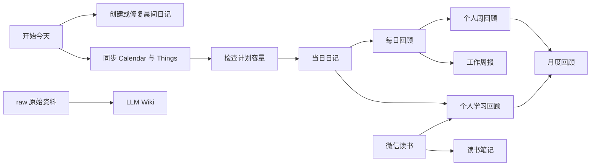

# big_orange_skills

一组围绕 Obsidian 构建的个人工作流 Skills，用自然语言驱动每日计划、日周月复盘、学习统计、微信读书笔记整理和个人知识库维护。

这个仓库关注的不是“生成一段看起来不错的文字”，而是让 Agent 按稳定规则读取真实记录、保留用户原文、增量写入，并在写入后验证结果。

## 能做什么

这套 Skills 大致组成了四条工作流：

- **开始与规划一天**：创建晨间日记、准备当日日记、同步 Calendar 和 Things、检查计划是否超过 9 小时。
- **日周月复盘**：根据日记与晨记统计计划和实际投入，识别偏差、模式与下一步行动。
- **学习与阅读**：区分个人学习和日常工作，结合微信读书数据统计投入并整理可复习的读书笔记。
- **知识库维护**：把 `raw/` 原始资料编译为摘要、概念、实体和索引，并进行有出处的问答与健康检查。



## Skill 一览

### 每日计划

| Skill | 用途 | 常见触发语 |
|---|---|---|
| [`start-today`](start-today/SKILL.md) | 编排完整的“开始今天”流程：晨记、当日日记、Calendar、Things 和容量提醒 | “开始今天”“帮我准备今天” |
| [`obsidian-morning-daily-note`](obsidian-morning-daily-note/SKILL.md) | 从模板创建或修复晨间日记，并确保当日日记及双向链接存在 | “创建今日晨间日记”“修复晨记链接” |
| [`today-tasks-add-to-obsidian`](today-tasks-add-to-obsidian/SKILL.md) | 初次准备当日日记中的每日计划 | “准备今日待办” |
| [`sync-today-plan-to-obsidian`](sync-today-plan-to-obsidian/SKILL.md) | 增量同步 Apple Calendar 与 Things Today，避免重复，并刷新计划容量提醒 | “刷新今天计划”“同步日历和 Things” |

`sync-today-plan-to-obsidian` 是 Calendar 和 Things 写入日记的唯一规范实现；其他入口只负责编排，不维护第二套同步逻辑。

### 回顾与总结

| Skill | 用途 | 默认范围 |
|---|---|---|
| [`daily-review`](daily-review/SKILL.md) | 统计计划与实际投入、分析偏差并回写每日回顾 | 昨天 |
| [`week-review`](week-review/SKILL.md) | 生成包含工作、生活、阅读和下周行动的个人周回顾 | 当前 ISO 周 |
| [`writing-weekly-report-review`](writing-weekly-report-review/SKILL.md) | 从日记提炼面向团队或管理者的工作周报 | 上一完整 ISO 周 |
| [`month-review`](month-review/SKILL.md) | 汇总自然月的事实、目标、模式和下月策略 | 当前自然月 |
| [`study-review`](study-review/SKILL.md) | 统计真正用于个人能力提升的投入，并结合微信读书数据 | 最近 7 个自然日 |

个人周回顾和工作周报可以写入同一个周文件，但各自使用独立的受管区块，不会互相覆盖。

### 阅读与知识库

| Skill | 用途 | 主要输出 |
|---|---|---|
| [`wchat-read-to-notes`](wchat-read-to-notes/SKILL.md) | 导出微信读书个人划线、想法和点评，生成保真版与二次整理版 | `pages-ai/*-读书笔记*.md` |
| [`llm-wiki`](llm-wiki/SKILL.md) | 摄取 `raw/` 资料，维护摘要、概念、实体与索引；支持知识问答和健康检查 | `wiki/`、`outputs/qa/`、`outputs/health/` |

> `wchat-read-to-notes` 的名称为兼容现有调用而保留，功能指的是 WeChat Read / 微信读书笔记整理。

## 设计原则

### 1. 原始资料只读

`raw/` 是用户拥有的源数据。LLM 可以读取，但不能修改、移动、重命名或删除。生成内容进入 `wiki/` 或 `outputs/`。

### 2. 保守增量写入

日记中的现有内容代表用户真实的工作现场。Skills 默认使用精确补丁，不整篇重写，不擅自调整 `DONE`、复选框、缩进、块 ID、链接、批注和用户补记的工时。

### 3. 幂等执行

重复运行不应不断追加相同内容。自动生成区域使用稳定的 HTML 注释标记，例如：

```markdown
<!-- daily-review:start 2026-07-31 -->
## 每日回顾
...
<!-- daily-review:end 2026-07-31 -->
```

旧版无标记内容只有在边界能够唯一确认时才会迁移；边界不明确则停止，而不是冒险覆盖。

### 4. 证据优先

回顾类 Skills 区分事实、推断与建议。没有实际记录时使用“未记录”或 `—`，不会把计划值、缺失数据或模型猜测包装成真实投入。

### 5. 写后验证

写入后重新读取目标文件，检查区块数量、日期范围、层级、统计结果和原文保护情况。验证失败时报告失败，不声称已经完成。

## 时间与日期约定

### 番茄钟标记

| 标记 | 含义 | 时长 |
|---|---|---:|
| 🍅 | 预估投入 | 25 分钟 |
| 🍉 | 预估投入 | 15 分钟 |
| 🥔 | 实际投入 | 25 分钟 |
| 🍠 | 实际投入 | 15 分钟 |

明确写出的实际时长优先于符号。同一条记录中的文字时长与符号不会重复计算；不同日期或不同时间片会分别累计。

### 日期归属

- 每日日记：`journals/YYYY-MM-DD.md`
- 晨间日记：`journals-morning/YYYYMMDD*.md`
- 周回顾：`journals-week/%G-W%V.md`
- 月回顾：`journals-month/YYYY-MM.md`
- ISO 周按周一至周日计算，跨年时使用 ISO week-year `%G`，而不是自然年 `%Y`。
- 晨间日记通常在 D+1 回顾 D，因此回顾流程按“内容归属日”关联，而不是机械使用文件日期。

### 计划容量

每日计划中的定时日程与待办预估相加：

- 总计严格大于 9 小时：在“每日投入”中维护一条受管提醒。
- 总计等于或小于 9 小时：不提醒，并移除已经过期的受管提醒。
- 全天日程没有明确时长，默认不计入容量，不推测为 24 小时。

## Vault 目录约定

```text
Vault/
├── assets/                 # 图片与附件
├── raw/                    # 原始资料，只读
│   ├── articles/
│   ├── last30days/
│   └── Readwise/
├── wiki/                   # LLM 维护的知识编译层
│   ├── indexes/
│   ├── summaries/
│   ├── concepts/
│   ├── entities/
│   └── log.md
├── outputs/
│   ├── qa/
│   └── health/
├── journals/
├── journals-morning/
├── journals-week/
├── journals-month/
├── pages-ai/
└── templates/
```

晨间流程默认使用以下模板：

```text
templates/【模板】晨间日记.md
templates/【模板】Habit Tracker - 上午.md
```

## 使用前准备

### 1. 获取仓库

```bash
git clone git@github.com:lvbo/big_orange_skills.git
```

每个一级子目录都是一个独立 Skill。按照你使用的 Agent 客户端约定，把需要的目录复制、软链接或注册到 Skills 搜索路径。编排型 Skill 的依赖也必须同时可用，例如 `start-today` 依赖晨记和计划同步相关 Skills。

### 2. 准备运行环境

基础环境：

- macOS
- 可读写的 Obsidian Vault
- 支持本地文件与 shell 操作的 Agent 客户端

按使用范围安装可选依赖：

| 能力 | 依赖 |
|---|---|
| Apple Calendar 同步 | `accli`（Apple Calendar CLI）或兼容命令 |
| Things Today 同步 | `things` CLI 与对应的 Things Skill |
| 微信读书数据 | `weread-skills`、有效的 `WEREAD_API_KEY` |
| Obsidian 日记 | 上述目录、模板和章节结构 |

### 3. 检查个人化配置

这些 Skills 来自个人工作流，并非克隆后零配置运行。至少检查：

- Calendar 名称，目前默认查询“工作”“个人”“吕波”。
- Vault 目录和模板名称。
- 日记中的 `### 每日计划`、`### 每日投入` 等标题层级。
- 番茄钟换算和 9 小时容量阈值是否适合你。
- Things CLI 的安装位置和访问权限。
- 微信读书 API Key、接口版本与底层 `weread-skills`。
- 系统时区以及 `date` 命令行为。

## 使用示例

安装并启用相应 Skill 后，直接用自然语言表达意图：

```text
开始今天
准备今日待办
刷新今天的每日计划
做昨天的每日回顾
做本周个人周回顾
写上周工作周报
做 2026 年 7 月月度复盘
回顾最近 7 天的个人学习投入
整理微信读书里的《书名》笔记
摄取 raw/articles/example.md 并更新 wiki
检查 wiki 的断链和重复概念
```

具体触发边界、失败处理和输出结构以各目录中的 `SKILL.md` 为准。

## 测试与维护

每个 Skill 都包含：

```text
skill-name/
├── SKILL.md
└── evals/
    ├── evals.json
    └── fixtures/
```

当前仓库为 11 个 Skills 准备了 29 个边界用例，覆盖：

- 重复执行与旧区块迁移；
- D+1 晨记归属和跨年 ISO 周；
- 9 小时 / 9 小时 1 分钟容量边界；
- 日记原文与手工区块保护；
- 微信读书分页、缺失图片和接口失败；
- `raw/` 只读、稳定来源 ID 和索引去重；
- 学习时间去重和数据缺失降级。

修改 Skill 后，至少执行：

```bash
git diff --check
find . -path '*/evals/evals.json' -print0 | xargs -0 -n1 jq empty
```

同时确认所有 `evals[].files` 指向的 fixture 存在，并为新增边界补充测试。

## 数据安全

- 不要把 API Key、访问令牌、Cookie 或个人账号信息写进 `SKILL.md`、测试 fixture 或提交历史。
- 测试微信读书等外部服务时，优先使用脱敏 mock，不要提交真实个人笔记回包。
- 在真实 Vault 上运行前做好备份，并先检查目标章节和受管区块。
- `MEMORY.md` 等私人配置文件不是运行这些 Skills 的必要条件；公开仓库前应单独检查其中是否包含个人信息。

## 仓库状态

这是一套持续迭代的个人工作流。它优先服务于当前 Vault 结构与使用习惯，也欢迎把通用规则抽象出来后复用到其他 Obsidian 工作流中。
